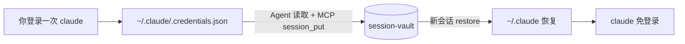

# Claude Code CLI 跨 Cloud Agent 会话复用

**不增加新的 Cursor MCP。** 只用你已有的 **session-vault**（`SESSION_VAULT_URL` + `SESSION_VAULT_TOKEN`）做唯一凭据仓库。

**不要**在 Cloud Agent Secrets 里再配一份 `CLAUDE_CODE_OAUTH_TOKEN`——登录态只进 vault，新会话只从 vault 取出。

## 数据流



Vault 键：`site=cli.claude`，`profile=default`，`kind=config`（文件 bundle）或 `kind=oauth`（若用 setup-token）。

## 一次性：登录后由 Agent 存入 vault

1. 你在本 VM 完成：`claude` 并完成 OAuth 登录。  
2. Agent 执行（读本地 + 调 **现有** MCP，不新加 server）：

```bash
python3 tools/session_vault_claude_code.py capture
```

内部用 `SESSION_VAULT_*` 调 vault REST，等价于 MCP：

`session_put(site=cli.claude, profile=default, kind=config, data=<bundle>)`

若你用 `claude setup-token`，把输出 token **只**交给 vault（仍不必写进 Agent Secrets）：

```bash
python3 tools/session_vault_claude_code.py capture-token --token 'sk-ant-oat01-...'
```

## 每个新 Cloud Agent 会话

Secrets 里只需保留 MCP 用的 `SESSION_VAULT_URL`、`SESSION_VAULT_TOKEN`（及可选 `SESSION_VAULT_OWNER`）。

Agent 在跑 `claude` 前：

```bash
python3 tools/session_vault_claude_code.py restore
eval "$(python3 tools/session_vault_claude_code.py print-env 2>/dev/null)"  # 仅 vault 里有 setup-token 时
claude -p "..."
```

`restore` 从 vault 拉取并写回 `~/.claude/.credentials.json`（`0600`）。**凭据只存在于 vault，不重复配置 Agent OAuth Secret。**

## 检查 vault 里是否已有 CLI 登录态

```bash
python3 tools/session_vault_claude_code.py status
# 或 MCP: session_get(site=cli.claude, profile=default, kind=config)
```

## 与浏览器 登录（claude.ai）的区别

| | Claude **Code CLI** | 网页 claude.ai |
|--|---------------------|----------------|
| 存什么 | `.credentials.json` / setup-token | `storage_state` / cookies |
| vault site | `cli.claude` | `claude.ai` |
| 工具 | `session_vault_claude_code.py` | `browser_session_save` / JS snippets |

两套互不替代：CLI 续命不用 Playwright；网页登录不用 CLI credentials。

## 安全

- 勿把 token 或 `.credentials.json` 提交仓库  
- 仅 `SESSION_VAULT_TOKEN` 与 `CLAUDE_CODE_OAUTH_TOKEN` 放在 Cloud Agent Secrets  
- `capture-token` 输出勿贴到公开 issue
