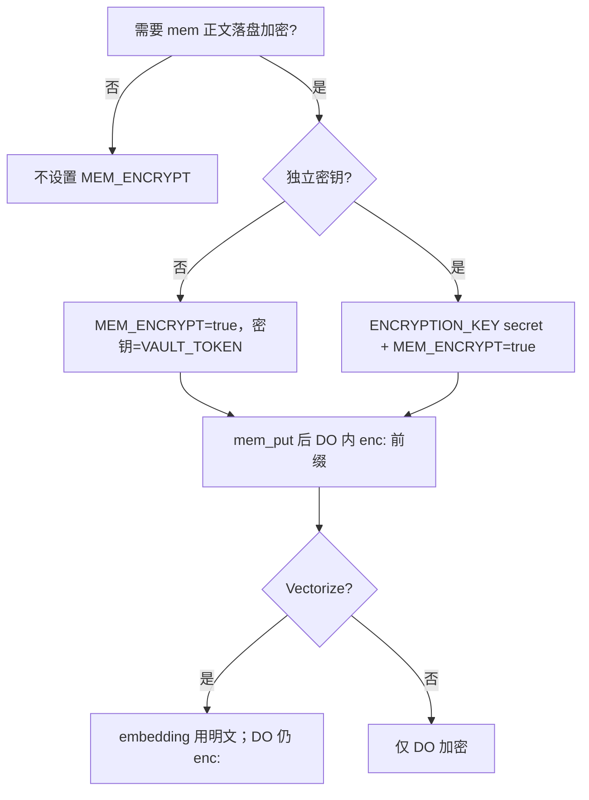

# mcp-cf-bots（SSOT）

> **维护规则**：本目录唯一长文档即本文件；`README.md` 仅一行入口。改代码前先更新此处。思维树：[mcp-cf-bots.mindmap](mcp-cf-bots.mindmap)。

HTTP MCP + REST on Cloudflare Workers：`sess_*` 会话、`mem_*` 记忆 RAG、`auth_token_*` 多租户。当前版本见 `wrangler.toml` → `MCP_SERVER_VERSION`。

## 路线图

> **SSOT**：[mcp-cf-bots.mindmap](mcp-cf-bots.mindmap)（`active_waves`、`for_discussion`、`last_deploy`）。**每轮**：merge `main` → test → `deploy.sh` → 更新本节。

### 产品一览（review）

| 支柱 | 能力 | 存储 |
|------|------|------|
| **sess_*** | 浏览器/Playwright 会话复用 | SessionStoreDO + RegistryDO |
| **mem_*** | 分块记忆、FTS+Vectorize 混合检索、导入/过期 | MemorySqliteDO + Vectorize |
| **auth** | 多租户 `cfb_*`、admin token、审计、按 owner 限流 | TOKENS KV |

对外：`GET /health` · `POST /mcp` · `/v1/session/*` · `/v1/mem/*` · `/v1/admin/*`（仅 admin）。

### 现状（v1.1.0）

| 项 | 说明 |
|----|------|
| **版本** | **`1.1.0`** — Brain/Code 算子模型；`brain_compose_context` GA |
| **本质** | LLM = **条件生成**；本产品提供 **多维上下文（Brain）** + **可执行操作（Code）** |
| **门禁** | `security-check` → test → integration → deploy → `verify-all-urls` |
| **下一步** | v1.1.x：token 预算裁剪、digest cron、search 反馈闭环 |

### Brain / Code 算子（对齐大模型本质）

| 算子 | 职责 | MCP 映射 |
|------|------|----------|
| **Brain** | 从存储 **选择 + 投影** 多维数据 → 模型可读 `ContextBlock[]` | `brain_compose_context`；辅助：`mem_search`、`resources/read`、`sess_meta` |
| **Code** | **确定性** 改变外部状态（可审计、可重放） | `mem_put/get/delete`、`sess_*`、`mem_import`、admin 工具 |

**上下文维**（`src/context-model.ts`）：`semantic` · `lexical` · `episodic` · `procedural` · `preference` · `task_frame` · `state` · `registry` · `meta`。

| 维 | 来源 | 写入约定 |
|----|------|----------|
| semantic / lexical | mem 向量 / FTS | `mem_put` |
| procedural / preference / episodic | mem + `kind:*` tag | `mem_put` + `kind` 参数 |
| task_frame | mem key | `task/*`、`decision/*` |
| state | 会话 | `sess_save` / `sess_meta` |

**Code 操作类**（`codeOpKind`）：`read` · `search` · `write` · `delete` · `session` · `compose` · `admin`。

### API（`api_version: 1.1`）

| 面 | 内容 |
|----|------|
| **新增** | `brain_compose_context`；`mem_put.kind` |
| **冻结** | v1.0 全部 `sess_*` / `mem_*` / admin / `mem://` |
| **移除** | `migrate-legacy` → 410 |

`/health`：`api_version`、`api_stable`。破坏性变更仅 **2.0**。

### 每轮标准流程

```bash
git fetch origin main && git merge origin/main
cd workers/mcp-cf-bots && ./scripts/deploy.sh
# 可选：MCP_CF_BOTS_VERIFY_URL=https://<worker>.<account>.workers.dev ./scripts/verify-deploy.sh
git checkout main && git merge <feature-branch> && git push origin main
```

`deploy.sh` 以 wrangler 输出的 **workers.dev** 做 version gate；`MCP_CF_BOTS_URL` 若不同会 WARN。

### 路线图（最新）

| 波次 | 状态 | 目标 |
|------|------|------|
| **W-卫生** | **完成** | cron 路由、HTTP 抽象、security-check、delete 限流 |
| **W0** | 持续 | merge → security-check → test → deploy → verify |
| **W2** | **完成** | DO embed + mock Vectorize hybrid 集成测 |
| **W3** | **完成** | TD-5：`deleted_classes` MemoryDO |
| **W4** | 运维 | CF API secrets → `cf_api_ready` |
| **v1.1** | **进行中** | Brain compose + kind 维；见 mindmap `v1_1` |

### 历史里程碑

| 版本 | 交付 |
|------|------|
| 0.6+ | 鉴权、`cfb_*` |
| 0.7+ | `mem_*`、Vectorize、公开状态页 |
| 0.8.x | SQLite DO、hybrid、cron、P0 migrate/GC |
| 0.9.0 | P1–P3：FTS、过滤、限流、审计、MCP resources |
| 0.9.1 | W2：Miniflare FTS 集成测、`auth_audit_list`、`mem_import` 限流 |
| 0.9.2 | custom_domain deploy、`verify-all-urls` |
| 0.9.3 | 卫生轮：admin cron 修复、owner/JSON 复用、security-check |
| 0.9.4 | W3：删 MemoryDO（v5 migration）、移除 legacy 迁移 API |
| 0.9.5 | MCP instructions、Agent 指南、sess 集成测、check/sync-cf-api |
| **1.0.0** | GA：`api_version` 1.0 冻结 |
| **1.1.0** | Brain/Code 模型、`brain_compose_context`、`mem_put.kind` |

### 每轮收尾清单

- [ ] `mcp-cf-bots.mindmap` → `roadmap.last_review`、阶段状态、`tech_debt`  
- [ ] 本表「当前阶段」与 `MCP_SERVER_VERSION` 一致  
- [ ] 若发版：`./scripts/deploy.sh` + `/health` + 可选 `POST /v1/admin/mem/cron`  
- [ ] 不新增散落 `.md`（只改 INDEX + mindmap）
- [ ] 遵守 [`engineering-hygiene`](../../skills/engineering-hygiene/SKILL.md) 开做/做中/收尾

### 不走弯路

- 交付方法学 → [`skills/mcp-cf-bots-delivery/`](../../skills/mcp-cf-bots-delivery/SKILL.md)（波次、门禁、MCP 运维剧本）。  
- 工程习惯 → [`skills/engineering-hygiene/`](../../skills/engineering-hygiene/SKILL.md)（**AGENTS.md** 默认），不用 `mem_*` 存规范。  
- 功能改动先问：是否强化 **sess / mem / auth** 三支柱？  
- 文档：仅 **INDEX + mindmap**，README 一行入口。

---

## 仓库文件

| 路径 | 用途 |
|------|------|
| [wrangler.toml](wrangler.toml) | Worker、DO/KV、cron、vars |
| [package.json](package.json) | npm 脚本、版本 |
| [mcp.recommended.json](mcp.recommended.json) | Cursor 远程 MCP 示例 |
| [.dev.vars.example](.dev.vars.example) | 本地 secret 模板 |
| [scripts/deploy.sh](scripts/deploy.sh) | ci → typecheck → test → deploy → smoke |
| [scripts/setup-rag.sh](scripts/setup-rag.sh) | Vectorize 索引 + deploy |
| [scripts/smoke.sh](scripts/smoke.sh) | `/health`、`/v1/me` |
| [scripts/verify-deploy.sh](scripts/verify-deploy.sh) | 单 URL：smoke + version |
| [scripts/verify-all-urls.sh](scripts/verify-all-urls.sh) | workers.dev + 自定义域双入口校验 |
| [scripts/security-check.sh](scripts/security-check.sh) | 静态安全/路由检查（deploy 前置） |
| [scripts/mem-vector-gc.sh](scripts/mem-vector-gc.sh) | 孤儿向量 GC |
| [scripts/issue_token.sh](scripts/issue_token.sh) | 签发 `cfb_*` |
| [scripts/diagnose-connection.sh](scripts/diagnose-connection.sh) | health + `/v1/me` + MCP initialize |
| [scripts/sync-vault-secret.sh](scripts/sync-vault-secret.sh) | `VAULT_TOKEN` → 正确 Worker |
| [scripts/sync-cf-api-secrets.sh](scripts/sync-cf-api-secrets.sh) | `CF_ACCOUNT_ID` + `CF_API_TOKEN` |
| [scripts/check-cf-api.sh](scripts/check-cf-api.sh) | `/health` 校验 `cf_api_ready` |
| [scripts/claude_worker.sh](scripts/claude_worker.sh) | restore vault → `claude` |
| [tools/](tools/) | Python 客户端 |
| [snippets/](snippets/) | 浏览器 Console cookie |
| [test/unit.test.ts](test/unit.test.ts) | vitest 单元 |
| [test/integration/](test/integration/) | Miniflare DO/FTS（`npm run test:integration`） |

## `src/` 模块

| 模块 | 职责 |
|------|------|
| [index.ts](src/index.ts) | 路由、cron `scheduled` |
| [status-board.ts](src/status-board.ts) | 公开 `GET /` |
| [owner-scope.ts](src/owner-scope.ts) | `ownerFromHttpRequest`、`ownerForTool` |
| [http-util.ts](src/http-util.ts) | JSON 解析、`safeEqual`、API 错误 |
| [health.ts](src/health.ts) | `/health`、`/v1/me` |
| [health-detail.ts](src/health-detail.ts) | 扩展 features、cron_last、自定义域 hint |
| [mcp-http.ts](src/mcp-http.ts) / [mcp-server.ts](src/mcp-server.ts) | MCP Streamable HTTP |
| [mcp-resources.ts](src/mcp-resources.ts) | MCP `resources/list`、`resources/read`（`mem://`） |
| [sess-tools.ts](src/sess-tools.ts) | `sess_*` |
| [mem-tools.ts](src/mem-tools.ts) | `mem_*` |
| [mem-fts.ts](src/mem-fts.ts) | FTS5 schema、关键词检索 |
| [rate-limit.ts](src/rate-limit.ts) | mem 按 owner 滑动窗口限流（KV） |
| [audit-log.ts](src/audit-log.ts) | 管理操作审计（KV） |
| [mem-reindex.ts](src/mem-reindex.ts) / [mem-vector-gc.ts](src/mem-vector-gc.ts) / [mem-cron.ts](src/mem-cron.ts) | 运维 |
| [memory-do.ts](src/memory-do.ts) | `MemorySqliteDO` |
| [auth.ts](src/auth.ts) / [admin-api.ts](src/admin-api.ts) | 鉴权、token |
| [vault-api.ts](src/vault-api.ts) / [mem-rest.ts](src/mem-rest.ts) | REST |

## API 速查

| 类型 | 路径 / 工具 |
|------|-------------|
| 公开 | `GET /`、`GET /health` |
| 鉴权 | `GET /v1/me`（Bearer admin 或 `cfb_*`） |
| MCP | `POST /mcp`（默认） |
| 会话 REST | `/v1/session/:site/:profile`、`GET /v1/sessions` |
| 记忆 REST | `/v1/mem`、`/v1/mem/:key`、`POST …/search|import|vector-gc|reindex` |
| Admin | `/v1/admin/tokens`、`GET /v1/admin/audit`、`POST /v1/admin/mem/cron` |
| MCP 工具 | `sess_*`、`mem_*`；admin：`auth_token_*`、`auth_audit_list`、`mem_reindex`、`mem_stats`、`mem_vector_gc` |
| MCP resources | `mem://<key>`（`resources/list`、`resources/read`） |

客户端环境变量：`MCP_CF_BOTS_URL`、`MCP_CF_BOTS_TOKEN`、`MCP_CF_BOTS_OWNER`（兼容 `SESSION_VAULT_*`）。

### Agent（MCP）— 主动使用指南

> Cursor / Cloud Agent：连接后服务端在 **`initialize` 响应**里返回 `instructions`（见 `src/mcp-instructions.ts`）；工具 `description` 也写明何时调用。仓库侧见根 [`AGENTS.md`](../../AGENTS.md)。

| 场景 | 应调用的工具 |
|------|----------------|
| 用户说「记住…」、偏好、项目事实、跨会话决策 | `mem_put`（稳定 `key` + `tags`） |
| 回答「之前说过什么」「上轮进展」、续做项目 | 先 `mem_search`，再 `mem_get` |
| 浏览器/Playwright 登录成功 | `sess_save`（`site` + `profile` + `storage_state`） |
| 自动化需要已登录站点 | 先 `sess_load`，再控浏览器 |
| 已知记忆 key | `resources/read` `mem://<key>` |
| 仓库工程规范、路线图、skill | **不要** `mem_put` → 改 INDEX / mindmap / `skills/` |

配置：[`mcp.recommended.json`](mcp.recommended.json) · [`.cursor/mcp.json`](../../.cursor/mcp.json)（`url` = `${MCP_CF_BOTS_URL}/mcp`，Bearer = `cfb_*`）。

### 连不上 / MCP 401（排查）

| 现象 | 原因 | 处理 |
|------|------|------|
| `/health` 200，但 `/mcp` 401 | `MCP_CF_BOTS_TOKEN` 无效或过短（占位符） | 用 **`cfb_*` 用户 token**，不是随便写的字符串 |
| admin 也 401 | `VAULT_TOKEN` secret 打在**别的 Worker** 上 | `CLOUDFLARE_WORKER_NAME` 须与 URL 路由一致 |

```bash
cd workers/mcp-cf-bots
./scripts/diagnose-connection.sh          # 看 health + /v1/me + initialize
./scripts/sync-vault-secret.sh            # 把 VAULT_TOKEN 写到正确 Worker
./scripts/issue_token.sh cloud-agent      # 签发 cfb_* → 填入 Cursor MCP_CF_BOTS_TOKEN
```

Cursor：[`/.cursor/mcp.json`](../../.cursor/mcp.json) 里 `url` = `${MCP_CF_BOTS_URL}/mcp`，`Authorization: Bearer ${MCP_CF_BOTS_TOKEN}`。

---

## 部署与上线

### 绑定与 Secrets

| Item | 说明 |
|------|------|
| `VAULT_TOKEN` | `wrangler secret put --name $CLOUDFLARE_WORKER_NAME`（与 URL 同 Worker） |
| `TOKENS` KV | `wrangler.toml` |
| `SESSION_STORE` / `REGISTRY` | DO + migrations |
| `MEMORY_STORE` → `MemorySqliteDO` | migration `v4`；`v5` 已 `deleted_classes` MemoryDO |
| `AI` + `MEM_VECTORS` | 语义检索；首次 `./scripts/setup-rag.sh` |
| `ENCRYPTION_KEY` | 可选，默认同 `VAULT_TOKEN` |
| `MEM_ENCRYPT` | 可选 var，DO 内 `enc:` 加密 |
| `MEM_RATE_LIMIT_PER_MIN` | 可选 var，mem 写操作限流（默认 120/min/owner） |
| `MCP_PUBLIC_HOST` | 可选 var，自定义域 hint（见下方） |
| `CF_ACCOUNT_ID` / `CF_API_TOKEN` | 可选：状态页用量、Vectorize list/GC |

### 部署命令

```bash
cd workers/mcp-cf-bots
./scripts/deploy.sh
# 或首次开 RAG：./scripts/setup-rag.sh
```

冒烟：`MCP_CF_BOTS_URL=... MCP_CF_BOTS_TOKEN=... ./scripts/smoke.sh`

Cursor MCP：仓库 [`.cursor/mcp.json`](../../.cursor/mcp.json)，`url` = `${env:MCP_CF_BOTS_URL}/mcp`。

### 自定义域

1. 在 Cloudflare 控制台为 Worker 绑定自定义域名（或与 `*.workers.dev` 同路由的 CNAME）。  
2. 在 [wrangler.toml](wrangler.toml) 取消注释并设置 `MCP_PUBLIC_HOST = "mcp.example.com"`（仅 host，无 `https://`）。  
3. 部署后 `GET /health` 响应含 `custom_domain_hint`；状态页与 MCP 路径与 `workers.dev` 一致。

CI：`.github/workflows/mcp-cf-bots.yml`（typecheck + vitest）。

### 安全（0.6+）

- `safeEqual` 校验 admin token
- `MAX_BODY_BYTES`（默认 2MB）
- key / owner / site / profile 格式校验
- 旧 MCP 名 `session_*` → `sess_*`（aliases）

---

## Cloudflare 服务

| 层级 | 服务 | `/health` |
|------|------|-----------|
| 必开 | Workers + DO + KV + `VAULT_TOKEN` | `memory: true` |
| RAG-1 | Workers AI | `rag: true`, `do_embed` |
| RAG-2 | + Vectorize | `rag_backend: vectorize` |

**0.9.0 `/health` 扩展**：`features`（含 `fts`、`cron_*`、`mem_encrypt` 等）、`cron_last`、`custom_domain_hint`（设 `MCP_PUBLIC_HOST` 时）。

```bash
./scripts/setup-rag.sh   # 索引 mcp-cf-bots-mem，768 维
curl -s "$MCP_CF_BOTS_URL/health"
```

API Token（Wrangler / GC）建议：Workers Scripts Edit、KV Edit、DO Edit、Vectorize Edit、Workers AI Read。

未开 RAG 时 `mem_search` 退化为 DO **FTS5** 关键词。

公开 `GET /` 状态页；可选 secrets `CF_ACCOUNT_ID`、`CF_API_TOKEN`（Analytics Read）显示 24h 用量。

**Cron（0.8.2）**：`0 4 * * *` UTC → 增量 reindex（按 `max_updated_at` 跳过未变 owner）+ 分页 Vectorize GC（`MEM_CRON_GC_PAGES_PER_RUN`，KV 游标续扫）。报告存 KV，状态页 `cron_last`；可选 `MEM_CRON_WEBHOOK_URL`。

| 运维 | 命令 |
|------|------|
| 手动 cron | `POST /v1/admin/mem/cron` |
| 孤儿向量 | `mem_vector_gc` / `DRY_RUN=1 ./scripts/mem-vector-gc.sh` |

---

## mem_* 记忆 RAG

| 工具 | 说明 |
|------|------|
| `mem_put` / `get` / `delete` / `list` | CRUD；put 自动分块 |
| `mem_search` | Hybrid RRF（Vectorize + FTS5）；可选 `tag`、`updated_after` / `updated_before` |
| `mem_import` | 批量导入 |
| `mem_reindex` / `mem_stats` / `mem_vector_gc` | Admin |

存储：**MemorySqliteDO**（全文 chunk + 配额 + `expires_at`）+ **Vectorize**（检索加速）+ **Workers AI** embedding。

wrangler 默认：`MEM_CHUNK_CHARS=1500`，`MAX_MEM_KEYS=2000`，`MAX_MEM_BYTES=8000000`。

pre-0.8 独立 `MemoryDO` 类已删除（0.9.4）；同 DO 内 blob 仍由 `MemorySqliteDO` 启动时 `migrateLegacyBlob` 处理。

### MEM_ENCRYPT 决策树



| 场景 | 建议 |
|------|------|
| 开发 | 不启用 |
| 多租户生产 | `MEM_ENCRYPT=true` |
| 合规隔离 | 独立 `ENCRYPTION_KEY` |
| 检索异常 | 跑 `mem_reindex` |

孤儿向量：`mem_vector_gc` / `POST /v1/mem/vector-gc` / `DRY_RUN=1 ./scripts/mem-vector-gc.sh <owner>`。

---

## 多用户 token

| 凭据 | 角色 | 能力 |
|------|------|------|
| `VAULT_TOKEN` | admin | 任意 owner、签发/吊销 token |
| `cfb_*` | user | 仅绑定 owner |

```bash
./scripts/issue_token.sh alice "Alice Cursor"
# 或 MCP auth_token_create
```

用户 MCP 只需 `Authorization: Bearer <cfb_*>`，勿再传 owner header。

管理：`GET/DELETE /v1/admin/tokens` 或 `auth_token_list` / `auth_token_revoke`。

---

## 浏览器自动化

| 层 | 工具 |
|----|------|
| 控浏览器 | Playwright MCP（`npx @playwright/mcp`） |
| 跨会话登录 | mcp-cf-bots `sess_save` / `sess_load` |

流程：Playwright 打开站 → 登录 → `sess_save`（cookies / `storage_state`）→ 新 Agent `sess_load` 续会话。

CLI：`tools/browser_cookies.py capture|apply`；Console：`snippets/capture-cookies.js`。

复杂开放式任务可用 Python browser-use（仓库未默认安装）。

---

## Claude 工人

| 角色 | 说明 |
|------|------|
| 中台 | Cloud Agent 拆任务、调 vault |
| 工人 | `claude_worker.sh -p "任务"` |
| Vault | `cli.claude` / `claude.ai` 分 site 存凭据 |

```bash
workers/mcp-cf-bots/scripts/claude_worker.sh -p "加测试，不改 API"
```

CLI 凭据：`tools/claude_code.py capture|restore|status`（等价 `sess_put` site=`cli.claude`）。

网页登录与 CLI 分开：网页用 `claude.ai` + `sess_save`；CLI 用 `cli.claude`。

---

## 技术债

| ID | 项 | 状态 |
|----|-----|------|
| TD-1 | 旧 `MemoryDO` stub | **done**（0.9.4） |
| TD-2 | pre-0.8 数据迁移 | **done** |
| TD-3 | Vectorize 孤儿 | mitigated（GC + cron） |
| TD-4 | Cron 全量 list 大索引慢 | mitigated（分页 + KV 游标） |
| TD-5 | `delete-class MemoryDO` | **done**（v5 migration） |
| TD-6 | FTS5 关键词 | mitigated（0.9.0） |
| TD-7 | Miniflare DO 集成测 | mitigated（FTS + hybrid + sess） |
| TD-8 | 自定义 URL 漂移 | mitigated（verify-all-urls） |
| TD-9 | admin cron 挂在 mem-rest 不可达 | mitigated（0.9.3 admin-api） |
| TD-10 | hybrid 无集成测 | mitigated（memory-hybrid.test.ts） |
| TD-11 | INDEX/mindmap 漂移 | mitigated（每轮收尾对齐） |
| TD-12 | 产线 `cf_api_ready` false | **W4** → `sync-cf-api-secrets.sh` |

详情同步 [mcp-cf-bots.mindmap](mcp-cf-bots.mindmap) → `tech_debt`。
