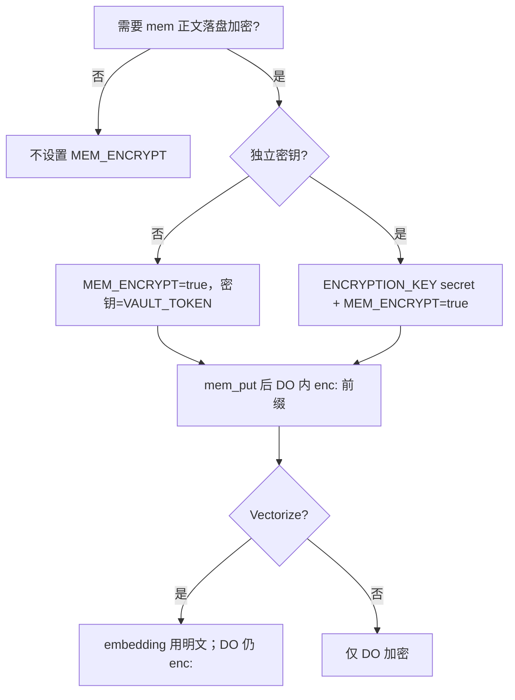

# mcp-cf-bots（SSOT）

> **维护规则**：本目录唯一长文档即本文件；`README.md` 仅一行入口。改代码前先更新此处。思维树：[mcp-cf-bots.mindmap](mcp-cf-bots.mindmap)。

HTTP MCP + REST on Cloudflare Workers：`sess_*` 会话、`mem_*` 记忆 RAG、`auth_token_*` 多租户。当前版本见 `wrangler.toml` → `MCP_SERVER_VERSION`。

## 路线图

> **SSOT 思维树**：[mcp-cf-bots.mindmap](mcp-cf-bots.mindmap)（`roadmap.active_waves`）。**每轮收尾必刷新**本节与 mindmap。

### 现状（v0.9.0）

| 项 | 值 |
|----|-----|
| **版本** | `0.9.0`（`wrangler.toml` → `MCP_SERVER_VERSION`） |
| **当前阶段** | **W0 稳态运维**（`steady-ops`） |
| **北极星** | 跨 Agent：`sess_*` + `mem_*` RAG + `cfb_*` 多租户 |
| **P0–P3** | 已归档（见 mindmap `completed_phases_archive`） |

### 下一波（按优先级，勿跳序大改检索）

| 波次 | 状态 | 目标 | 启动条件 |
|------|------|------|----------|
| **W0 稳态** | **进行中** | CI 绿、cron/health 可观测、文档同步 | 持续 |
| **W1 落地 0.9.0** | **下一步** | 合 PR、deploy、smoke；可选 `MCP_PUBLIC_HOST` | PR 合入 + `deploy.sh` 本地绿 |
| **W2 集成测** | backlog | Miniflare / vitest-pool：DO + hybrid | W1 已上线、无 P0 事故 |
| **W3 TD-5** | blocked | 删 `MemoryDO` class + 去 `MEMORY_LEGACY` | 全 owner 已 migrate，binding 可改 |

**可选（无排期）**：生产 `MEM_ENCRYPT`、状态页 CF 用量图、hybrid 调参、MCP prompts。

### 反思（0.9.0 后）

- **已闭合**：检索栈（FTS + 过滤）、运维面（health/cron）、安全面（限流/审计）、产品面（`mem://` resources）。
- **仍欠**：真 DO 集成测（TD-7）、legacy class 物理删除（TD-5）。
- **协作**：并行 Task 按**单文件**拆；`memory-do` / 路由合并留在主线程。

### 历史里程碑

| 版本 | 交付 |
|------|------|
| 0.6+ | 鉴权、`cfb_*` |
| 0.7+ | `mem_*`、Vectorize、公开状态页 |
| 0.8.x | SQLite DO、hybrid、cron、P0 migrate/GC |
| 0.9.0 | P1–P3：FTS、过滤、限流、审计、MCP resources |

### 每轮收尾清单

- [ ] `mcp-cf-bots.mindmap` → `roadmap.last_review`、阶段状态、`tech_debt`  
- [ ] 本表「当前阶段」与 `MCP_SERVER_VERSION` 一致  
- [ ] 若发版：`./scripts/deploy.sh` + `/health` + 可选 `POST /v1/admin/mem/cron`  
- [ ] 不新增散落 `.md`（只改 INDEX + mindmap）
- [ ] 遵守 [`engineering-hygiene`](../../skills/engineering-hygiene/SKILL.md) 开做/做中/收尾

### 不走弯路

- 工程习惯 → 仓库 [`skills/engineering-hygiene/`](../../skills/engineering-hygiene/SKILL.md)（**AGENTS.md** 默认 skill），不用 `mem_*` 存规范。  
- 功能改动先问：是否强化 **sess / mem / auth** 三支柱？  
- 文档：仅 **INDEX + mindmap**，README 一行入口。

---

## 仓库文件

| 路径 | 用途 |
|------|------|
| [wrangler.toml](wrangler.toml) | Worker、DO/KV、cron、vars |
| [package.json](package.json) | npm 脚本、版本 |
| [mcp.recommended.json](mcp.recommended.json) | Cursor 远程 MCP 示例 |
| [.dev.vars.example](.dev.vars.example) | 本地 secret 模板 |
| [scripts/deploy.sh](scripts/deploy.sh) | ci → typecheck → test → deploy → smoke |
| [scripts/setup-rag.sh](scripts/setup-rag.sh) | Vectorize 索引 + deploy |
| [scripts/smoke.sh](scripts/smoke.sh) | `/health`、`/v1/me` |
| [scripts/mem-vector-gc.sh](scripts/mem-vector-gc.sh) | 孤儿向量 GC |
| [scripts/mem-migrate-legacy.sh](scripts/mem-migrate-legacy.sh) | 旧 MemoryDO 迁移 |
| [scripts/issue_token.sh](scripts/issue_token.sh) | 签发 `cfb_*` |
| [scripts/claude_worker.sh](scripts/claude_worker.sh) | restore vault → `claude` |
| [tools/](tools/) | Python 客户端 |
| [snippets/](snippets/) | 浏览器 Console cookie |
| [test/unit.test.ts](test/unit.test.ts) | vitest |

## `src/` 模块

| 模块 | 职责 |
|------|------|
| [index.ts](src/index.ts) | 路由、cron `scheduled` |
| [status-board.ts](src/status-board.ts) | 公开 `GET /` |
| [health.ts](src/health.ts) | `/health`、`/v1/me` |
| [health-detail.ts](src/health-detail.ts) | 扩展 features、cron_last、自定义域 hint |
| [mcp-http.ts](src/mcp-http.ts) / [mcp-server.ts](src/mcp-server.ts) | MCP Streamable HTTP |
| [mcp-resources.ts](src/mcp-resources.ts) | MCP `resources/list`、`resources/read`（`mem://`） |
| [sess-tools.ts](src/sess-tools.ts) | `sess_*` |
| [mem-tools.ts](src/mem-tools.ts) | `mem_*` |
| [mem-fts.ts](src/mem-fts.ts) | FTS5 schema、关键词检索 |
| [rate-limit.ts](src/rate-limit.ts) | mem 按 owner 滑动窗口限流（KV） |
| [audit-log.ts](src/audit-log.ts) | 管理操作审计（KV） |
| [mem-reindex.ts](src/mem-reindex.ts) / [mem-vector-gc.ts](src/mem-vector-gc.ts) / [mem-cron.ts](src/mem-cron.ts) | 运维 |
| [memory-do.ts](src/memory-do.ts) | `MemorySqliteDO` |
| [memory-do-legacy.ts](src/memory-do-legacy.ts) | 旧 `MemoryDO` stub |
| [auth.ts](src/auth.ts) / [admin-api.ts](src/admin-api.ts) | 鉴权、token |
| [vault-api.ts](src/vault-api.ts) / [mem-rest.ts](src/mem-rest.ts) | REST |

## API 速查

| 类型 | 路径 / 工具 |
|------|-------------|
| 公开 | `GET /`、`GET /health` |
| 鉴权 | `GET /v1/me`（Bearer admin 或 `cfb_*`） |
| MCP | `POST /mcp`（默认） |
| 会话 REST | `/v1/session/:site/:profile`、`GET /v1/sessions` |
| 记忆 REST | `/v1/mem`、`/v1/mem/:key`、`POST …/search|import|migrate-legacy|vector-gc|reindex` |
| Admin | `/v1/admin/tokens`、`GET /v1/admin/audit`、`POST /v1/admin/mem/cron` |
| MCP 工具 | `sess_*`、`mem_*`；admin：`auth_token_*`、`mem_migrate_legacy`、`mem_reindex`、`mem_stats`、`mem_vector_gc` |
| MCP resources | `mem://<key>`（`resources/list`、`resources/read`） |

客户端环境变量：`MCP_CF_BOTS_URL`、`MCP_CF_BOTS_TOKEN`、`MCP_CF_BOTS_OWNER`（兼容 `SESSION_VAULT_*`）。

---

## 部署与上线

### 绑定与 Secrets

| Item | 说明 |
|------|------|
| `VAULT_TOKEN` | `wrangler secret put` — admin Bearer |
| `TOKENS` KV | `wrangler.toml` |
| `SESSION_STORE` / `REGISTRY` | DO + migrations |
| `MEMORY_STORE` → `MemorySqliteDO` | migration `v4`；旧 `MemoryDO` 仅 stub |
| `AI` + `MEM_VECTORS` | 语义检索；首次 `./scripts/setup-rag.sh` |
| `ENCRYPTION_KEY` | 可选，默认同 `VAULT_TOKEN` |
| `MEM_ENCRYPT` | 可选 var，DO 内 `enc:` 加密 |
| `MEM_RATE_LIMIT_PER_MIN` | 可选 var，mem 写操作限流（默认 120/min/owner） |
| `MCP_PUBLIC_HOST` | 可选 var，自定义域 hint（见下方） |
| `CF_ACCOUNT_ID` / `CF_API_TOKEN` | 可选：状态页用量、Vectorize list/GC |

### 部署命令

```bash
cd workers/mcp-cf-bots
./scripts/deploy.sh
# 或首次开 RAG：./scripts/setup-rag.sh
```

冒烟：`MCP_CF_BOTS_URL=... MCP_CF_BOTS_TOKEN=... ./scripts/smoke.sh`

Cursor MCP：仓库 [`.cursor/mcp.json`](../../.cursor/mcp.json)，`url` = `${env:MCP_CF_BOTS_URL}/mcp`。

### 自定义域

1. 在 Cloudflare 控制台为 Worker 绑定自定义域名（或与 `*.workers.dev` 同路由的 CNAME）。  
2. 在 [wrangler.toml](wrangler.toml) 取消注释并设置 `MCP_PUBLIC_HOST = "mcp.example.com"`（仅 host，无 `https://`）。  
3. 部署后 `GET /health` 响应含 `custom_domain_hint`；状态页与 MCP 路径与 `workers.dev` 一致。

CI：`.github/workflows/mcp-cf-bots.yml`（typecheck + vitest）。

### 安全（0.6+）

- `safeEqual` 校验 admin token
- `MAX_BODY_BYTES`（默认 2MB）
- key / owner / site / profile 格式校验
- 旧 MCP 名 `session_*` → `sess_*`（aliases）

---

## Cloudflare 服务

| 层级 | 服务 | `/health` |
|------|------|-----------|
| 必开 | Workers + DO + KV + `VAULT_TOKEN` | `memory: true` |
| RAG-1 | Workers AI | `rag: true`, `do_embed` |
| RAG-2 | + Vectorize | `rag_backend: vectorize` |

**0.9.0 `/health` 扩展**：`features`（含 `fts`、`cron_*`、`mem_encrypt` 等）、`cron_last`、`custom_domain_hint`（设 `MCP_PUBLIC_HOST` 时）。

```bash
./scripts/setup-rag.sh   # 索引 mcp-cf-bots-mem，768 维
curl -s "$MCP_CF_BOTS_URL/health"
```

API Token（Wrangler / GC）建议：Workers Scripts Edit、KV Edit、DO Edit、Vectorize Edit、Workers AI Read。

未开 RAG 时 `mem_search` 退化为 DO **FTS5** 关键词。

公开 `GET /` 状态页；可选 secrets `CF_ACCOUNT_ID`、`CF_API_TOKEN`（Analytics Read）显示 24h 用量。

**Cron（0.8.2）**：`0 4 * * *` UTC → 增量 reindex（按 `max_updated_at` 跳过未变 owner）+ 分页 Vectorize GC（`MEM_CRON_GC_PAGES_PER_RUN`，KV 游标续扫）。报告存 KV，状态页 `cron_last`；可选 `MEM_CRON_WEBHOOK_URL`。

| 运维 | 命令 |
|------|------|
| 手动 cron | `POST /v1/admin/mem/cron` |
| 旧 DO 迁移 | `mem_migrate_legacy` / `POST /v1/mem/migrate-legacy`（需 `MEMORY_LEGACY` 绑定） |
| 孤儿向量 | `mem_vector_gc` / `DRY_RUN=1 ./scripts/mem-vector-gc.sh` |

---

## mem_* 记忆 RAG

| 工具 | 说明 |
|------|------|
| `mem_put` / `get` / `delete` / `list` | CRUD；put 自动分块 |
| `mem_search` | Hybrid RRF（Vectorize + FTS5）；可选 `tag`、`updated_after` / `updated_before` |
| `mem_import` | 批量导入 |
| `mem_reindex` / `mem_stats` / `mem_vector_gc` | Admin |

存储：**MemorySqliteDO**（全文 chunk + 配额 + `expires_at`）+ **Vectorize**（检索加速）+ **Workers AI** embedding。

wrangler 默认：`MEM_CHUNK_CHARS=1500`，`MAX_MEM_KEYS=2000`，`MAX_MEM_BYTES=8000000`。

升级自 pre-0.8 `MemoryDO`：**需重新** `mem_put` / `mem_import`（不自动迁移实例）。

### MEM_ENCRYPT 决策树



| 场景 | 建议 |
|------|------|
| 开发 | 不启用 |
| 多租户生产 | `MEM_ENCRYPT=true` |
| 合规隔离 | 独立 `ENCRYPTION_KEY` |
| 检索异常 | 跑 `mem_reindex` |

孤儿向量：`mem_vector_gc` / `POST /v1/mem/vector-gc` / `DRY_RUN=1 ./scripts/mem-vector-gc.sh <owner>`。

---

## 多用户 token

| 凭据 | 角色 | 能力 |
|------|------|------|
| `VAULT_TOKEN` | admin | 任意 owner、签发/吊销 token |
| `cfb_*` | user | 仅绑定 owner |

```bash
./scripts/issue_token.sh alice "Alice Cursor"
# 或 MCP auth_token_create
```

用户 MCP 只需 `Authorization: Bearer <cfb_*>`，勿再传 owner header。

管理：`GET/DELETE /v1/admin/tokens` 或 `auth_token_list` / `auth_token_revoke`。

---

## 浏览器自动化

| 层 | 工具 |
|----|------|
| 控浏览器 | Playwright MCP（`npx @playwright/mcp`） |
| 跨会话登录 | mcp-cf-bots `sess_save` / `sess_load` |

流程：Playwright 打开站 → 登录 → `sess_save`（cookies / `storage_state`）→ 新 Agent `sess_load` 续会话。

CLI：`tools/browser_cookies.py capture|apply`；Console：`snippets/capture-cookies.js`。

复杂开放式任务可用 Python browser-use（仓库未默认安装）。

---

## Claude 工人

| 角色 | 说明 |
|------|------|
| 中台 | Cloud Agent 拆任务、调 vault |
| 工人 | `claude_worker.sh -p "任务"` |
| Vault | `cli.claude` / `claude.ai` 分 site 存凭据 |

```bash
workers/mcp-cf-bots/scripts/claude_worker.sh -p "加测试，不改 API"
```

CLI 凭据：`tools/claude_code.py capture|restore|status`（等价 `sess_put` site=`cli.claude`）。

网页登录与 CLI 分开：网页用 `claude.ai` + `sess_save`；CLI 用 `cli.claude`。

---

## 技术债

| ID | 项 | 状态 |
|----|-----|------|
| TD-1 | 旧 `MemoryDO` stub | mitigated |
| TD-2 | pre-0.8 数据迁移 | mitigated（`mem_migrate_legacy`） |
| TD-3 | Vectorize 孤儿 | mitigated（GC + cron） |
| TD-4 | Cron 全量 list 大索引慢 | mitigated（分页 + KV 游标） |
| TD-5 | `delete-class MemoryDO` | blocked → **W3** |
| TD-6 | FTS5 关键词 | mitigated（0.9.0） |
| TD-7 | Miniflare DO 集成测 | open → **W2** |

详情同步 [mcp-cf-bots.mindmap](mcp-cf-bots.mindmap) → `tech_debt`。
