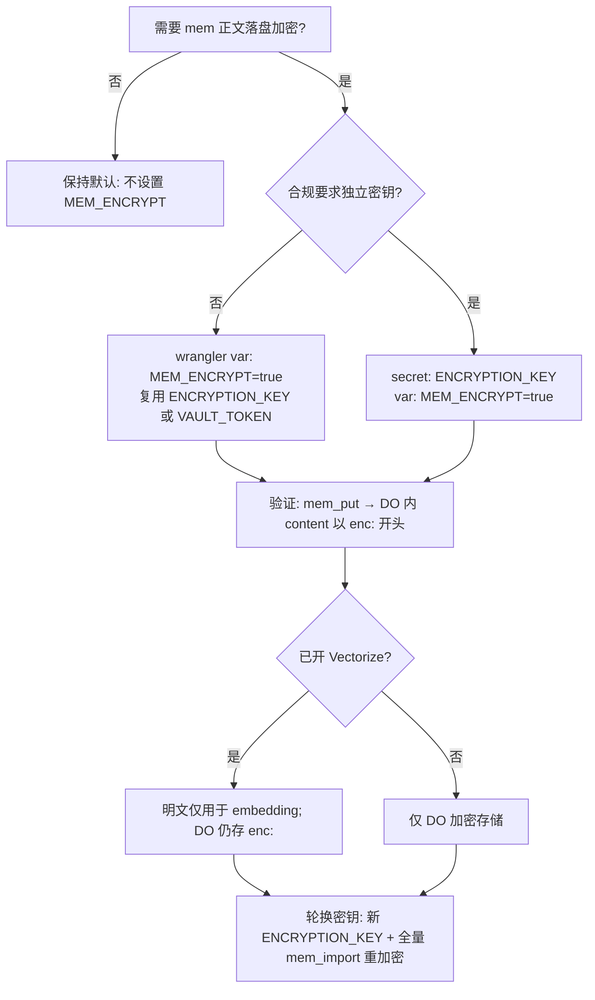

# mcp-cf-bots — production checklist

完整目录索引：[INDEX.md](INDEX.md)

## Required bindings & secrets

| Item | Wrangler / Dashboard |
|------|----------------------|
| `VAULT_TOKEN` | `wrangler secret put VAULT_TOKEN` (admin Bearer) |
| `TOKENS` KV | `[[kv_namespaces]]` in `wrangler.toml` |
| `SESSION_STORE` / `REGISTRY` DO | durable object bindings + migrations applied |
| `MEMORY_STORE` → `MemorySqliteDO` | migration `v4` (`new_sqlite_classes`); legacy `MemoryDO` stub only |
| `AI` + `MEM_VECTORS` | semantic `mem_search` (`rag_backend: vectorize`); run `./scripts/setup-rag.sh` once |
| Optional `ENCRYPTION_KEY` | separate AES key; defaults to `VAULT_TOKEN` |
| Optional `MEM_ENCRYPT=true` | encrypt memory chunk bodies at rest in DO |

Run `assertProdEnv` expectations before go-live: all of the above must exist on the target Worker.

## Public endpoints

| Route | Auth | Purpose |
|-------|------|---------|
| `GET /health` | none | Liveness (`ok`, `service`, `version`) |
| `GET /v1/me` | Bearer | Whoami (`admin` or `user` + `owner`) |

All other routes require `Authorization: Bearer <admin or cfb_*>`.

## Hardening (0.6+)

- Constant-time admin token compare (`safeEqual`)
- `Content-Length` cap via `MAX_BODY_BYTES` (default 2MB)
- `site` / `profile` / `owner` format validation
- Security headers on JSON responses (`nosniff`, `no-store`)
- Legacy MCP tool aliases (`session_*` → `sess_*`) on `tools/call` only

## Deploy

```bash
cd workers/mcp-cf-bots
./scripts/deploy.sh
```

Post-deploy:

```bash
export MCP_CF_BOTS_URL=https://mcp-cf-bots.<account>.workers.dev
export MCP_CF_BOTS_TOKEN=<admin secret>
./scripts/smoke.sh
```

## Multi-tenant tokens

Issue per-user tokens (admin only):

```bash
./scripts/issue_token.sh <owner> [label]
```

Users get `sess_*` scoped to their `owner`; admin retains `auth_token_*` and cross-tenant access via `owner` arg/header.

## Memory (0.8+)

- After upgrading from pre-0.8 `MemoryDO`, **re-import** memories (`mem_put` / `mem_import`); old DO instances are not auto-migrated.
- Admin: `mem_reindex` rebuilds Vectorize from DO chunks; `mem_stats` for quota visibility.
- Vars: `MEM_CHUNK_CHARS`, `MAX_MEM_KEYS`, `MAX_MEM_BYTES` in `wrangler.toml`.
- 思维树 / 技术债：[mcp-cf-bots.mindmap](mcp-cf-bots.mindmap)、[docs/TECH-DEBT.md](docs/TECH-DEBT.md)

### Cron（0.8.1+）

| 变量 | 默认 | 作用 |
|------|------|------|
| `MEM_CRON_REINDEX` | `true` | 每日 UTC 04:00 对各 owner 跑 `mem_reindex` |
| `MEM_CRON_VECTOR_GC` | `true` | 同上，删 Vectorize 孤儿向量（需 CF API） |
| `MEM_CRON_OWNER_LIMIT` | `32` | 每 tick 最多处理 owner 数 |
| `MEM_CRON_OWNERS` | — | 额外 owner，逗号分隔 |

手动触发：`POST /v1/admin/mem/cron`（admin Bearer）。CLI：`./scripts/mem-vector-gc.sh <owner>`（`DRY_RUN=1` 预检）。

部署：`./scripts/deploy.sh`（或首次 RAG：`./scripts/setup-rag.sh`）。

### MEM_ENCRYPT 决策树



| 场景 | 建议 |
|------|------|
| 开发 / 低敏 | 不启用 |
| 多租户生产、无合规分包 | `MEM_ENCRYPT=true`，密钥=VAULT_TOKEN |
| 合规要求密钥与会话隔离 | `ENCRYPTION_KEY` secret + `MEM_ENCRYPT=true` |
| 启用后检索异常 | 确认 `mem_reindex`；解密仅在 DO 读路径自动完成 |

### Vectorize 孤儿向量

| 方式 | 命令 |
|------|------|
| MCP | `mem_vector_gc`（`dry_run` 可选） |
| REST | `POST /v1/mem/vector-gc` |
| CLI | `DRY_RUN=1 ./scripts/mem-vector-gc.sh owner` |
| Cron | `MEM_CRON_VECTOR_GC=true` + secrets `CF_ACCOUNT_ID`、`CF_API_TOKEN`（Vectorize Edit） |

## Custom domain

Point your custom MCP hostname to the same Worker as `mcp-cf-bots` so tool names and routes stay in sync with `*.workers.dev`.

## CI

GitHub Actions workflow `.github/workflows/mcp-cf-bots.yml` runs `typecheck` + `vitest` on changes under `workers/mcp-cf-bots/`.
