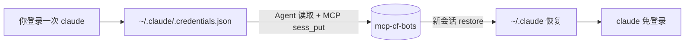

# Claude Code CLI 跨 Cloud Agent 会话复用

**不增加新的 Cursor MCP。** 只用 **mcp-cf-bots**（`MCP_CF_BOTS_URL` + `MCP_CF_BOTS_TOKEN`；旧名 `SESSION_VAULT_*` 仍可用）做唯一凭据仓库。

**不要**在 Cloud Agent Secrets 里再配一份 `CLAUDE_CODE_OAUTH_TOKEN`——登录态只进 vault，新会话只从 vault 取出。

## 数据流



Vault 键：`site=cli.claude`，`profile=default`，`kind=config`（文件 bundle）或 `kind=oauth`（若用 setup-token）。

## 一次性：登录后由 Agent 存入 vault

```bash
python3 workers/mcp-cf-bots/tools/claude_code.py capture
```

等价于 MCP：`sess_put(site=cli.claude, profile=default, kind=config, data=<bundle>)`

## 每个新 Cloud Agent 会话

Secrets：`MCP_CF_BOTS_URL`、`MCP_CF_BOTS_TOKEN`、可选 `MCP_CF_BOTS_OWNER`。

```bash
python3 workers/mcp-cf-bots/tools/claude_code.py restore
eval "$(python3 workers/mcp-cf-bots/tools/claude_code.py print-env 2>/dev/null)"
claude -p "..."
```

## 检查 vault

```bash
python3 workers/mcp-cf-bots/tools/claude_code.py status
# 或 MCP: sess_get(site=cli.claude, profile=default, kind=config)
```

## 与浏览器登录的区别

| | Claude **Code CLI** | 网页 claude.ai |
|--|---------------------|----------------|
| 存什么 | `.credentials.json` / setup-token | `storage_state` / cookies |
| vault site | `cli.claude` | `claude.ai` |
| 工具 | `tools/claude_code.py` | `sess_save` / JS snippets |

## 安全

- 勿把 token 或 `.credentials.json` 提交仓库  
- `MCP_CF_BOTS_TOKEN` 放在 Cloud Agent Secrets  
