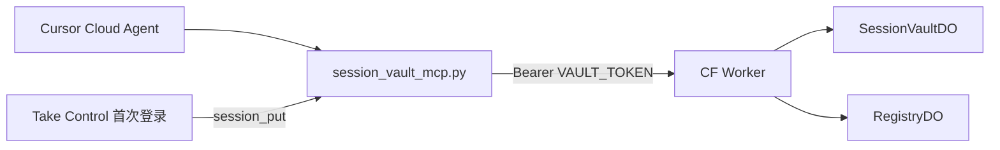

# session-vault

跨 Cursor Cloud Agent 实例共享的 **OAuth / cookie / Playwright storageState** 保险箱。

## 技术栈分工

| 组件 | 运行时 | 说明 |
|------|--------|------|
| **Worker + DO** | [Cloudflare Workers](https://developers.cloudflare.com/workers/) | 仅 Web 标准 API（`fetch`、`crypto.subtle`、`DurableObject` 等），由 **wrangler** 编译部署，**不用 Bun/Node** |
| **MCP 客户端** | **Python**（推荐）或 Bun TS | `products/session_vault_mcp.py`；可选 `session_vault_mcp.ts` |

- **存储**：Worker + Durable Object（AES-GCM，无 KV/D1）
- **DO 命名**：`vault/{owner}/{site}/{profile}`（`owner` 默认 `default`，`?owner=` 可覆盖）

## 架构



## REST API

| 方法 | 路径 | 说明 |
|------|------|------|
| PUT | `/v1/session/{site}/{profile}` | JSON body：`oauth` / `cookies` / `storage_state` / `meta` |
| GET | `/v1/session/{site}/{profile}` | 可选 `?kind=oauth\|cookies\|storage_state` |
| DELETE | `/v1/session/{site}/{profile}` | 清空该 profile |
| GET | `/v1/sessions` | 列出 Registry 索引（`session_list`） |

所有写/读接口需：`Authorization: Bearer $VAULT_TOKEN`

## 部署

### 1. 环境变量（Cloud Agent Secrets 或本地 export）

```bash
# 仅检查是否 set，勿 echo 明文
test -n "$CLOUDFLARE_API_TOKEN" && echo CLOUDFLARE_API_TOKEN=set
test -n "$CLOUDFLARE_ACCOUNT_ID" && echo CLOUDFLARE_ACCOUNT_ID=set
echo "CLOUDFLARE_WORKER_NAME=${CLOUDFLARE_WORKER_NAME:-session-vault}"
echo "CLOUDFLARE_WORKER_DOMAIN=${CLOUDFLARE_WORKER_DOMAIN:-}"
```

### 2. 安装与部署

```bash
cd /workspace/workers/session-vault
npm install
export CLOUDFLARE_API_TOKEN=... CLOUDFLARE_ACCOUNT_ID=...
npx wrangler whoami

# 可选：覆盖 Worker 名
export CLOUDFLARE_WORKER_NAME="${CLOUDFLARE_WORKER_NAME:-session-vault}"
npx wrangler deploy --name "$CLOUDFLARE_WORKER_NAME"
```

### 3. Secrets（勿提交仓库）

```bash
# 随机 token（示例生成，请自行保存供 MCP）
openssl rand -base64 32 | npx wrangler secret put VAULT_TOKEN

# 可选：单独加密密钥；未设则用 VAULT_TOKEN 派生 AES-256
# openssl rand -base64 32 | npx wrangler secret put ENCRYPTION_KEY
```

记录 `VAULT_TOKEN` 明文一次，供 MCP 的 `SESSION_VAULT_TOKEN`（**不要**把 `CLOUDFLARE_API_TOKEN` 给 MCP）。

### 4. Smoke test

```bash
export SESSION_VAULT_URL="https://<your-worker>.<subdomain>.workers.dev"
export SESSION_VAULT_TOKEN="<same-as-VAULT_TOKEN-secret>"

curl -sS -X PUT "$SESSION_VAULT_URL/v1/session/example.com/default" \
  -H "Authorization: Bearer $SESSION_VAULT_TOKEN" \
  -H "Content-Type: application/json" \
  -d '{"storage_state":{"cookies":[],"origins":[]},"meta":{"expires_at":"2099-01-01T00:00:00Z"}}'

curl -sS "$SESSION_VAULT_URL/v1/session/example.com/default?kind=storage_state" \
  -H "Authorization: Bearer $SESSION_VAULT_TOKEN"
```

## Cursor / Claude MCP 配置

```bash
export SESSION_VAULT_URL="https://<your-worker>.<subdomain>.workers.dev"
export SESSION_VAULT_TOKEN="<vault-token>"

claude mcp add session-vault python3 /workspace/products/session_vault_mcp.py server
```

可选（Bun TS 同等工具）：

```bash
export PATH="$HOME/.bun/bin:$PATH"
claude mcp add session-vault bun /workspace/products/session_vault_mcp.ts server
```

在 Cursor Cloud Agent 环境变量中设置 `SESSION_VAULT_URL`、`SESSION_VAULT_TOKEN`（及可选 `SESSION_VAULT_OWNER`）。

### Tools

| Tool | 参数 |
|------|------|
| `session_put` | `site`, `profile`, `kind` (`oauth`\|`cookies`\|`storage_state`), `data`, optional `owner`, `expires_at` |
| `session_get` | `site`, `profile`, optional `kind`, `owner` |
| `session_delete` | `site`, `profile`, optional `owner` |
| `session_list` | optional `owner` |

## 安全

- `CLOUDFLARE_API_TOKEN` 仅用于 `wrangler deploy`，**不得**写入 MCP 配置或仓库
- 日志与 MCP 返回中避免打印 cookie / token 明文
- 所有 API 请求校验 `Authorization: Bearer`
- DO 内字段经 AES-GCM 加密后写入 `state.storage`

## 后续扩展

- **R2**：超大 `storage_state`  offload，DO 只存指针
- **KV**：全局 `site/profile` 索引（当前 MVP 用 `RegistryDO`）
- **Remote MCP HTTP**：Worker 侧 Streamable HTTP MCP，免本地 stdio

## 用户手动步骤

1. 配置 Cloudflare Secrets 并 `wrangler deploy`
2. 将 `SESSION_VAULT_URL` + `SESSION_VAULT_TOKEN` 写入 Agent / `claude mcp` 环境
3. **Take Control** 完成目标站首次登录后，由 Agent 调用 `session_put(..., kind=storage_state, data=...)` 持久化
4. 其它 Cloud Agent 实例通过 `session_get` 拉取同一 `owner/site/profile`
