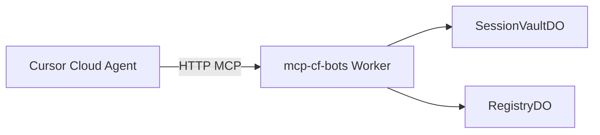

# mcp-cf-bots

部署目录仍为 `workers/session-vault/`（历史路径）。**Cloudflare 上的 HTTP MCP**：跨 Agent 会话保险箱（后续 `mem_*` 记忆）。

## 技术栈

| 组件 | 说明 |
|------|------|
| **Worker + DO** | MCP `POST /mcp` + REST `/v1/session/...` |
| **Cursor** | 远程 HTTP MCP，无需本地 Python/Bun stdio 客户端 |

- **存储**：Durable Object + AES-GCM
- **DO 命名**：`vault/{owner}/{site}/{profile}`

## 架构



辅助脚本（非 MCP，直调 REST）：`tools/session_vault_claude_code.py`、`tools/session_vault_browser_cookies.py`。

## REST API

| 方法 | 路径 | 说明 |
|------|------|------|
| PUT | `/v1/session/{site}/{profile}` | JSON：`oauth` / `cookies` / `storage_state` / `meta` |
| GET | `/v1/session/{site}/{profile}` | 可选 `?kind=...` |
| DELETE | `/v1/session/{site}/{profile}` | 清空 profile |
| GET | `/v1/sessions` | Registry 列表 |

鉴权：`Authorization: Bearer $VAULT_TOKEN`

## 部署

```bash
cd /workspace/workers/session-vault
npm install
export CLOUDFLARE_API_TOKEN=... CLOUDFLARE_ACCOUNT_ID=...
export CLOUDFLARE_WORKER_NAME="${CLOUDFLARE_WORKER_NAME:-mcp-cf-bots}"
npx wrangler deploy --name "$CLOUDFLARE_WORKER_NAME"
openssl rand -base64 32 | npx wrangler secret put VAULT_TOKEN
```

```bash
export MCP_CF_BOTS_URL="https://<your-worker>.workers.dev"
export MCP_CF_BOTS_TOKEN="<vault-token>"

curl -sS -X PUT "$MCP_CF_BOTS_URL/v1/session/example.com/default" \
  -H "Authorization: Bearer $MCP_CF_BOTS_TOKEN" \
  -H "Content-Type: application/json" \
  -d '{"storage_state":{"cookies":[],"origins":[]}}'
```

## Cursor MCP 配置（唯一推荐方式）

`POST /mcp`（根路径 `POST /` 在带 MCP Accept 头时同等可用）。

```json
{
  "mcpServers": {
    "mcp-cf-bots": {
      "url": "https://<your-mcp-host>/mcp",
      "headers": {
        "Authorization": "Bearer <VAULT_TOKEN>",
        "X-Cf-Bots-Owner": "cloud-agent"
      }
    }
  }
}
```

Cloud Agent Secrets：`MCP_CF_BOTS_URL`、`MCP_CF_BOTS_TOKEN`、可选 `MCP_CF_BOTS_OWNER`。  
兼容旧名：`SESSION_VAULT_*`、HTTP 头 `X-Session-Vault-Owner`。

### MCP 工具（`sess_*`）

| Tool | 说明 |
|------|------|
| `sess_save` | 一次写入 `storage_state` / `oauth` / `cookies` / `config` + meta |
| `sess_load` | 读出 browser-use 会话 |
| `sess_meta` | 只读元数据 |
| `sess_put` | 单 kind 写入 |
| `sess_get` | 读取 |
| `sess_delete` | 删除 |
| `sess_list` | 列表 |

### 迁移（v0.3 → v0.4）

| 旧工具名 | 新工具名 |
|----------|----------|
| `browser_session_save` | `sess_save` |
| `browser_session_load` | `sess_load` |
| `session_*` | `sess_*` |

MCP id：`session-vault` → **`mcp-cf-bots`**。已移除 `products/*_mcp.py|ts` 本地 stdio 客户端。

## 跨 Agent 示例

1. `sess_save(site="github.com", profile="default", storage_state={...})`
2. 新实例：`sess_load(...)`
3. `sess_list(owner="team")`

## 安全

- `CLOUDFLARE_API_TOKEN` 仅用于 deploy
- DO payload AES-GCM 加密

## 后续

- `mem_*`：工作记忆（同 Worker、新 DO）
- R2 offload 超大 `storage_state`
