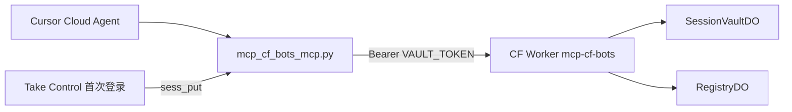

# mcp-cf-bots

部署目录仍为 `workers/session-vault/`（历史路径）。产品名 **mcp-cf-bots**：放在 Cloudflare 上的 MCP 版机器人服务（跨 Agent 会话、后续记忆）。

## 技术栈分工

| 组件 | 运行时 | 说明 |
|------|--------|------|
| **Worker + DO** | [Cloudflare Workers](https://developers.cloudflare.com/workers/) | 仅 Web 标准 API，**wrangler** 部署 |
| **MCP 客户端** | **Python**（推荐）或 Bun TS | `products/mcp_cf_bots_mcp.py` |

- **存储**：Worker + Durable Object（AES-GCM）
- **DO 命名**：`vault/{owner}/{site}/{profile}`

## 架构



## REST API

| 方法 | 路径 | 说明 |
|------|------|------|
| PUT | `/v1/session/{site}/{profile}` | JSON：`oauth` / `cookies` / `storage_state` / `meta` |
| GET | `/v1/session/{site}/{profile}` | 可选 `?kind=...` |
| DELETE | `/v1/session/{site}/{profile}` | 清空 profile |
| GET | `/v1/sessions` | Registry 列表 |

鉴权：`Authorization: Bearer $VAULT_TOKEN`

## 部署

```bash
cd /workspace/workers/session-vault
npm install
export CLOUDFLARE_API_TOKEN=... CLOUDFLARE_ACCOUNT_ID=...
export CLOUDFLARE_WORKER_NAME="${CLOUDFLARE_WORKER_NAME:-mcp-cf-bots}"
npx wrangler deploy --name "$CLOUDFLARE_WORKER_NAME"
openssl rand -base64 32 | npx wrangler secret put VAULT_TOKEN
```

Smoke test（环境变量可用新名或旧名）：

```bash
export MCP_CF_BOTS_URL="https://<your-worker>.workers.dev"
export MCP_CF_BOTS_TOKEN="<vault-token>"

curl -sS -X PUT "$MCP_CF_BOTS_URL/v1/session/example.com/default" \
  -H "Authorization: Bearer $MCP_CF_BOTS_TOKEN" \
  -H "Content-Type: application/json" \
  -d '{"storage_state":{"cookies":[],"origins":[]}}'
```

## Cursor / Claude MCP 配置

### 远程 HTTP MCP（推荐）

`POST /mcp`（根路径 `POST /` 在带 MCP Accept 头时同等可用）。

```json
{
  "mcpServers": {
    "mcp-cf-bots": {
      "url": "https://<your-mcp-host>/mcp",
      "headers": {
        "Authorization": "Bearer <VAULT_TOKEN>",
        "X-Cf-Bots-Owner": "cloud-agent"
      }
    }
  }
}
```

兼容旧头：`X-Session-Vault-Owner` 仍可用。

### 本地 stdio MCP（可选）

```bash
export MCP_CF_BOTS_URL="https://<your-worker>.workers.dev"
export MCP_CF_BOTS_TOKEN="<vault-token>"

claude mcp add mcp-cf-bots python3 /workspace/products/mcp_cf_bots_mcp.py server
```

Cloud Agent Secrets：`MCP_CF_BOTS_URL`、`MCP_CF_BOTS_TOKEN`、可选 `MCP_CF_BOTS_OWNER`。  
旧名 `SESSION_VAULT_*` 在客户端仍可作为回退。

### MCP 工具（`sess_*`）

| Tool | 说明 |
|------|------|
| `sess_save` | 一次写入 `storage_state` / `oauth` / `cookies` / `config` + meta |
| `sess_load` | 读出 browser-use 会话（默认仅 `storage_state`） |
| `sess_meta` | 只读元数据 |
| `sess_put` | 单 kind 写入 |
| `sess_get` | 读取（可选 `kind`） |
| `sess_delete` | 删除 site/profile |
| `sess_list` | 列表（owner / source / tag 过滤） |

### 迁移（v0.3 → v0.4）

| 旧工具名 | 新工具名 |
|----------|----------|
| `browser_session_save` | `sess_save` |
| `browser_session_load` | `sess_load` |
| `session_meta` | `sess_meta` |
| `session_put` | `sess_put` |
| `session_get` | `sess_get` |
| `session_delete` | `sess_delete` |
| `session_list` | `sess_list` |

MCP 服务 id：`session-vault` → **`mcp-cf-bots`**。  
入口脚本：`session_vault_mcp.py` → **`mcp_cf_bots_mcp.py`**（旧路径仍可用，会打 deprecation 提示）。

## 跨 Agent 复用示例

1. Agent A：`sess_save(site="github.com", profile="default", storage_state={...}, owner="team")`
2. Agent B：`sess_load(site="github.com", profile="default", owner="team")`
3. 发现：`sess_list(owner="team")` 或 `sess_meta(...)`

## 安全

- `CLOUDFLARE_API_TOKEN` 仅用于 deploy，不得写入 MCP
- DO 内 payload AES-GCM 加密

## 后续

- `mem_*` 工具：跨 Agent 工作记忆（同 MCP、新 DO）
- R2 offload 超大 `storage_state`
